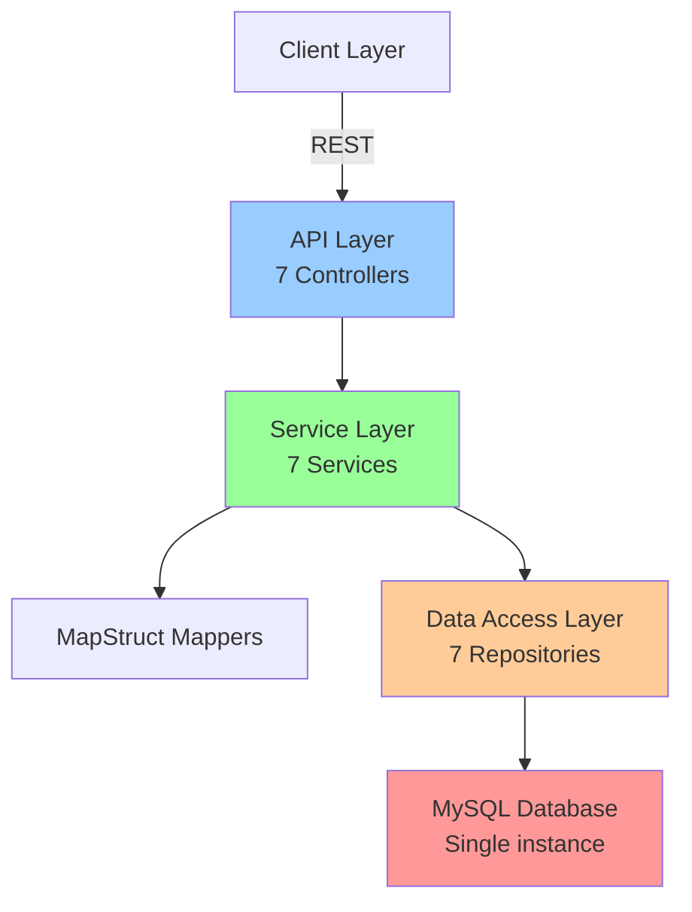
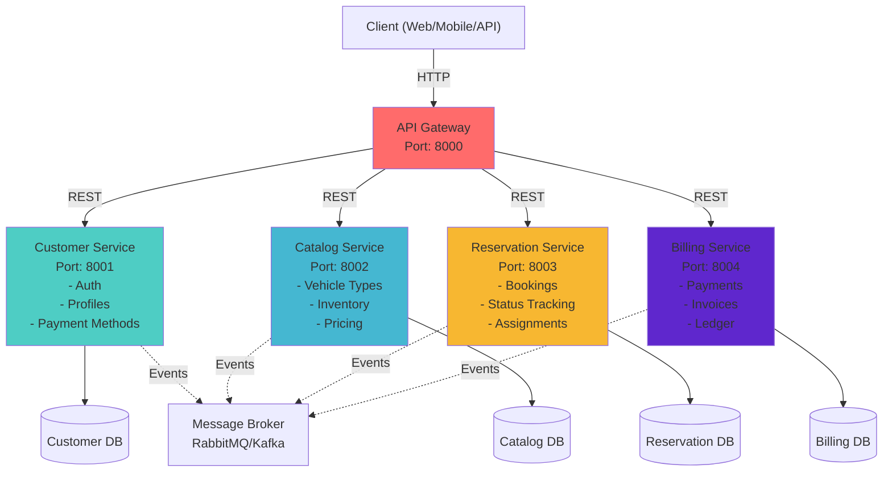
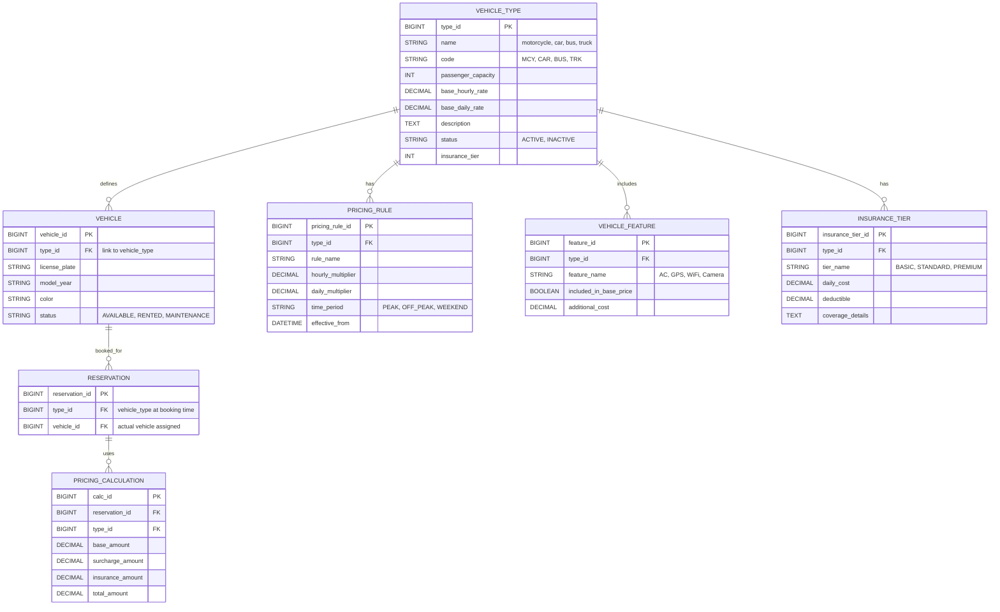
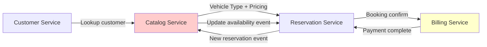

# Architecture Enhancement Assessment & Impact Document

**Car Reservation System (CRS)**  
**Date**: February 18, 2026  
**Version**: 1.0 - Initial Assessment  
**Prepared by**: Architecture Review Team

---

## Executive Summary

This document provides a comprehensive assessment of two major enhancement initiatives:

1. **Monolithic → Microservices Transformation**
2. **Multi-Vehicle Type Support Enhancement**

### Current State
- Monolithic Spring Boot 3 application
- 7 core entities serving car rental scenarios
- Single database (MySQL)
- CRUD REST API at `/api/*`

### Proposed Outcome
- Microservices-based architecture (4-5 independent services)
- Support for multiple vehicle types (motorcycle, car, bus, truck, etc.)
- Event-driven inter-service communication
- Type-specific pricing, availability, and operational rules
- Enhanced scalability and resilience

### Impact Summary
| Aspect | Impact | Effort | Risk |
|--------|--------|--------|------|
| Code Structure | High | 200-300 hrs | Medium |
| Database | High | 40-60 hrs | Medium |
| API Contracts | High | 60-80 hrs | Low |
| Data Migration | Moderate | 20-40 hrs | High |
| Testing | High | 120-150 hrs | Medium |
| DevOps/Deployment | Moderate | 40-60 hrs | Medium |

**Total Estimated Effort**: 480-790 hours (3-5 weeks with 4-person team)  
**Risk Level**: Medium-High (data migration, eventual consistency)

---

## Part 1: Monolithic to Microservices Transformation

### 1.1 Current Monolithic Architecture



#### Disadvantages of Current Monolithic Approach
1. **Scalability**: Entire app scales together; can't scale individual features
2. **Technology Lock-in**: All services bound to Spring Boot/Java/MySQL
3. **Team Silos**: Hard to have independent optimization by business function
4. **Deployment Risk**: Single failure point affects all functionality
5. **Database Coupling**: All business logic tightly coupled via shared DB
6. **Slow Development Cycles**: Requires full app rebuild/test for minor changes

---

### 1.2 Proposed Microservices Architecture

#### Recommended Service Split (4 Services)



#### Service Breakdown

##### **1. Customer Service** (Port 8001)
**Responsibility**: User management, authentication, profiles, payment methods

**Endpoints**:
```
POST   /api/customers/register
GET    /api/customers/{id}
PUT    /api/customers/{id}
DELETE /api/customers/{id}
POST   /api/customers/{id}/payment-methods
GET    /api/customers/{id}/payment-methods
```

**Database**: `customer_db` (PostgreSQL recommended)

**Entities**:
- Customer
- PaymentMethod
- CustomerProfile

**Dependencies**: None (independent)

---

##### **2. Catalog Service** (Port 8002)
**Responsibility**: Vehicle inventory, types, models, pricing, availability

**Endpoints**:
```
GET    /api/vehicle-types              # List all vehicle types
GET    /api/vehicles                   # List vehicles with filtering
GET    /api/vehicles/{id}
POST   /api/vehicles                   # Admin: add vehicle
PUT    /api/vehicles/{id}
GET    /api/pricing/{vehicleTypeId}    # Price by type & duration
```

**Database**: `catalog_db` (PostgreSQL)

**Entities**:
- VehicleType (NEW)
- Vehicle (enhanced)
- PricingRule (NEW)
- VehicleFeatures (NEW)
- Availability (NEW)

**Key Enhancements**:
- Vehicle discriminator by type (motorcycle, car, bus, etc.)
- Type-specific pricing rules (per hour, per day, per km)
- Type-specific availability windows
- Type-specific insurance tiers

---

##### **3. Reservation Service** (Port 8003)
**Responsibility**: Booking management, reservation lifecycle, assignments

**Endpoints**:
```
POST   /api/reservations/create
GET    /api/reservations/{id}
PUT    /api/reservations/{id}/status
DELETE /api/reservations/{id}/cancel
GET    /api/reservations/availability    # Check real-time availability
POST   /api/reservations/{id}/driver-assignment
GET    /api/feedback
POST   /api/feedback
```

**Database**: `reservation_db` (PostgreSQL)

**Entities**:
- Reservation
- ReservationStatus (NEW - enum)
- DriverAssignment (NEW)
- Feedback

**Public Events**:
```
reservation.created
reservation.confirmed
reservation.canceled
reservation.completed
driver.assigned
```

**Consumed Events**:
- `payment.completed` → confirm reservation
- `vehicle.unavailable` → adjust availability

---

##### **4. Billing Service** (Port 8004)
**Responsibility**: Payment processing, invoicing, financial ledger

**Endpoints**:
```
POST   /api/payments/process
GET    /api/payments/{id}
GET    /api/invoices/{reservationId}
GET    /api/billing-ledger
```

**Database**: `billing_db` (PostgreSQL)

**Entities**:
- Payment
- Invoice (NEW)
- BillingLedger (NEW)
- BillingAudit (NEW)

**Public Events**:
```
payment.initiated
payment.completed
payment.failed
invoice.generated
```

**Consumed Events**:
- `reservation.completed` → generate invoice

---

### 1.3 Supporting Infrastructure

#### API Gateway (Spring Cloud Gateway)
- Central entry point
- Request routing to services
- Authentication/authorization
- Rate limiting
- Request/response logging

```yaml
spring:
  cloud:
    gateway:
      routes:
        - id: customer-service
          uri: http://localhost:8001
          predicates:
            - Path=/api/customers/**
        - id: catalog-service
          uri: http://localhost:8002
          predicates:
            - Path=/api/vehicles/**,/api/vehicle-types/**
        # ... more routes
```

#### Message Broker (RabbitMQ/Apache Kafka)
- Asynchronous event publishing
- Service decoupling
- Event replay capability
- Guaranteed message delivery

**Events**:
```
reservation.*
payment.*
vehicle.*
customer.*
```

#### Service Discovery (Eureka or Consul)
- Automatic service registration
- Health monitoring
- Load balancing
- Failover handling

#### Distributed Tracing (Jaeger/Zipkin)
- Request flow tracking across services
- Performance bottleneck identification
- Debugging complex issues

#### Configuration Management (Spring Cloud Config)
- Centralized configuration
- Environment-specific properties
- Dynamic property updates

---

### 1.4 Data Migration Strategy

#### Phase 1: Database Separation (Week 1-2)

**Before**:
```
MySQL: car_rsvt
├── customer (all user data)
├── vehicle (inventory)
├── driver (staff)
├── reservation (bookings)
├── payment (transactions)
├── payment_method (payment info)
└── feedback (reviews)
```

**After**:
```
PostgreSQL: customer_db        PostgreSQL: catalog_db         PostgreSQL: reservation_db    PostgreSQL: billing_db
├── customer               ├── vehicle_type            ├── reservation          ├── payment
├── payment_method         ├── vehicle                 ├── feedback             ├── invoice
└── customer_audit         ├── pricing_rule            ├── driver_assignment    └── billing_audit
                           ├── vehicle_features        └── reservation_status
                           └── availability
```

#### Phase 2: Data Transformation

**Step 1**: Extract data from monolithic MySQL
```sql
-- Customer data → customer_db
SELECT * FROM customer WHERE id > 0;

-- Vehicle data → catalog_db
-- Create default vehicle_type entries
INSERT INTO vehicle_type (name, code, capacity, hourly_rate)
VALUES ('Car', 'CAR', 5, 50.00);

-- Map existing vehicles to types
INSERT INTO vehicle_type_mapping 
SELECT DISTINCT vehicle_type FROM vehicle;
```

**Step 2**: Transform and load into new databases
```
customer_db ← Monolithic DB (customer, payment_method, customer_audit)
catalog_db ← Monolithic DB (vehicle) + New data (vehicle_type, pricing_rules)
reservation_db ← Monolithic DB (reservation, feedback, driver_assignment)
billing_db ← Monolithic DB (payment) + New entities (invoice, ledger)
```

**Step 3**: Validation and reconciliation
```
Total records before = Total records after
Implement data auditing triggers
Run daily reconciliation jobs for 2 weeks
```

#### Phase 3: Dual-Write Period (Week 2-3)
- Monolithic system writes to both old and new databases
- New services read from new databases (for testing)
- Gradual traffic cutover to new services
- Fallback capability to monolithic system

#### Phase 4: Cutover (Week 3-4)
- Full traffic switched to microservices
- Monolithic system in read-only mode
- Monitoring and observation period (2 weeks)
- Decommission monolithic system

---

### 1.5 Implementation Roadmap

```
Week 1: Infrastructure Setup
├── Set up API Gateway
├── Configure message broker (RabbitMQ/Kafka)
├── Set up service discovery (Eureka)
├── Deploy monitoring (Jaeger, Prometheus)
└── Create deployment pipelines

Week 2: Service Development (parallel)
├── Customer Service (standalone)
├── Catalog Service (with Vehicle Types)
├── Reservation Service (event producers)
└── Billing Service (event consumers)

Week 3: Integration & Testing
├── Event publishing/consuming
├── Integration tests across services
├── Load testing
└── Failover scenarios

Week 4: Migration & Deployment
├── Dual-write setup
├── Data migration
├── Gradual traffic cutover
└── Monitoring and fixes
```

---

## Part 2: Multi-Vehicle Type Support Enhancement

### 2.1 Current Vehicle Type Handling

**Current Implementation**:
```java
public class Vehicle {
    private Long vehicleId;
    private String vehicleType;      // Just a string: "car", "motorcycle", etc.
    private String licensePlate;
    private String status;
    private Driver driver;
}
```

**Issues**:
- Vehicle type is just a string (no constraints)
- No type-specific pricing
- No type-specific capacity/features
- No type-specific availability rules
- No type-specific insurance tiers
- Pricing is generic (not per-type)

---

### 2.2 Enhanced Vehicle Type Architecture

#### New Data Model



#### SQL Schema Changes

```sql
-- New table: vehicle_type
CREATE TABLE vehicle_type (
    type_id BIGINT PRIMARY KEY AUTO_INCREMENT,
    name VARCHAR(50) NOT NULL UNIQUE,
    code VARCHAR(10) NOT NULL UNIQUE,      -- MCY, CAR, BUS, TRK
    passenger_capacity INT,
    cargo_capacity DECIMAL(10,2),          -- in liters
    base_hourly_rate DECIMAL(10,2),
    base_daily_rate DECIMAL(10,2),
    description TEXT,
    status VARCHAR(20) DEFAULT 'ACTIVE',
    fuel_type VARCHAR(20),                 -- PETROL, DIESEL, EV
    transmission VARCHAR(20),              -- MANUAL, AUTO
    created_at TIMESTAMP DEFAULT NOW()
) ENGINE=InnoDB;

-- Enhanced vehicle table
ALTER TABLE vehicle ADD COLUMN (
    type_id BIGINT NOT NULL FOREIGN KEY REFERENCES vehicle_type(type_id),
    model_year INT,
    color VARCHAR(50),
    fuel_type VARCHAR(20),
    transmission VARCHAR(20),
    mileage_km INT DEFAULT 0,
    registration_expiry DATE,
    insurance_expiry DATE,
    maintenance_due_km INT
);

-- New table: pricing_rule
CREATE TABLE pricing_rule (
    rule_id BIGINT PRIMARY KEY AUTO_INCREMENT,
    type_id BIGINT NOT NULL FOREIGN KEY REFERENCES vehicle_type(type_id),
    rule_name VARCHAR(100),
    rule_type VARCHAR(20),                 -- HOURLY, DAILY, KM_BASED
    hourly_multiplier DECIMAL(5,2) DEFAULT 1.0,
    daily_multiplier DECIMAL(5,2) DEFAULT 1.0,
    km_rate DECIMAL(10,2),                 -- per km
    time_period VARCHAR(20),               -- PEAK, OFF_PEAK, WEEKEND
    effective_from DATETIME,
    effective_to DATETIME,
    priority INT
) ENGINE=InnoDB;

-- New table: vehicle_feature
CREATE TABLE vehicle_feature (
    feature_id BIGINT PRIMARY KEY AUTO_INCREMENT,
    type_id BIGINT NOT NULL FOREIGN KEY REFERENCES vehicle_type(type_id),
    feature_name VARCHAR(100),
    included_in_base BOOLEAN DEFAULT FALSE,
    additional_cost DECIMAL(10,2) DEFAULT 0,
    description TEXT
) ENGINE=InnoDB;

-- New table: insurance_tier
CREATE TABLE insurance_tier (
    tier_id BIGINT PRIMARY KEY AUTO_INCREMENT,
    type_id BIGINT NOT NULL FOREIGN KEY REFERENCES vehicle_type(type_id),
    tier_name VARCHAR(50),                 -- BASIC, STANDARD, PREMIUM
    daily_cost DECIMAL(10,2),
    deductible DECIMAL(10,2),
    max_coverage DECIMAL(10,2),
    coverage_details TEXT
) ENGINE=InnoDB;

-- Pricing calculation history
CREATE TABLE pricing_calculation (
    calc_id BIGINT PRIMARY KEY AUTO_INCREMENT,
    reservation_id BIGINT NOT NULL FOREIGN KEY REFERENCES reservation(reservation_id),
    type_id BIGINT NOT NULL FOREIGN KEY REFERENCES vehicle_type(type_id),
    base_amount DECIMAL(10,2),
    hourly_rate DECIMAL(10,2),
    daily_rate DECIMAL(10,2),
    km_rate DECIMAL(10,2),
    hours_reserved INT,
    days_reserved INT,
    km_reserved INT,
    subtotal DECIMAL(10,2),
    surcharge_amount DECIMAL(10,2),
    tax_amount DECIMAL(10,2),
    insurance_tier_id BIGINT FOREIGN KEY REFERENCES insurance_tier(tier_id),
    insurance_amount DECIMAL(10,2),
    total_amount DECIMAL(10,2),
    calculated_at TIMESTAMP DEFAULT NOW()
) ENGINE=InnoDB;
```

---

### 2.3 Vehicle Type Variations & Capabilities

#### Supported Vehicle Types

| Type | Capacity | Features | Pricing Model | Insurance | Status |
|------|----------|----------|---------------|-----------|--------|
| **Motorcycle** | 1-2 | Helmet, Navigation | Hourly-focused | Basic | ✓ Implement Phase 1 |
| **Car** | 4-5 | AC, GPS, WiFi | Hourly/Daily mix | Standard | ✓ Implement Phase 1 |
| **Sedan** | 4-5 | Luxury, All-wheel | Hourly/Daily | Premium | Phase 2 |
| **SUV** | 5-7 | Large cargo, 4WD | Daily-focused | Premium | Phase 2 |
| **Bus** | 30-50 | Air suspension, WiFi | Daily/Weekly | Heavy-duty | Phase 2 |
| **Truck** | 1-3 | Cargo box, Lift | Daily/KM-based | Heavy-duty | Phase 2 |
| **Van** | 8-12 | Removable rows, Large cargo | Daily | Standard | Phase 3 |

#### Type-Specific Pricing Example

**Motorcycle**:
- Hourly: $15 base + 20% peak surcharge
- Insurance: $5/day (basic)
- Features: Helmet (included), GPS (+$2/day)

**Car**:
- Hourly: $30 | Daily: $200
- Insurance: $12/day (standard)
- Features: AC (included), WiFi (+$3/day), Dash cam (+$5/day)

**Bus**:
- Daily: $500 | Weekly: $3000
- Insurance: $40/day (heavy-duty)
- Per km: +$2 after 200km/day
- Fuel surcharge: varies by diesel prices

---

### 2.4 Pricing Engine Enhancements

#### Dynamic Pricing Calculation

```java
// Pseudocode for pricing calculation
public class PricingCalculator {
    
    public PricingResult calculatePrice(ReservationRequest request) {
        // 1. Get vehicle type
        VehicleType type = getVehicleType(request.vehicleTypeId);
        
        // 2. Calculate base rental cost
        BigDecimal baseCost = calculateBaseCost(
            type,
            request.pickupTime,
            request.dropoffTime,
            request.estimatedKm
        );
        
        // 3. Apply dynamic surcharges
        BigDecimal surcharge = calculateSurcharges(
            type,
            request.pickupTime,    // Peak hours?
            request.season,        // Peak season?
            request.dayOfWeek      // Weekend?
        );
        
        // 4. Add insurance cost
        BigDecimal insuranceCost = calculateInsurance(
            type,
            request.insuranceTier,
            request.durationDays
        );
        
        // 5. Calculate savings (early booking, loyalty)
        BigDecimal discount = calculateDiscount(
            request.customerId,
            request.bookingAdvanceDays
        );
        
        // 6. Apply taxes
        BigDecimal tax = (baseCost + surcharge + insuranceCost - discount) * TAX_RATE;
        
        return PricingResult(
            baseCost,
            surcharge,
            insuranceCost,
            discount,
            tax,
            baseCost + surcharge + insuranceCost - discount + tax
        );
    }
    
    private BigDecimal calculateBaseCost(VehicleType type, ...) {
        if (rentalDays <= 1) {
            return type.getHourlyRate() * hours;
        } else if (rentalDays <= 7) {
            return type.getDailyRate() * days;
        } else {
            BigDecimal weeklyRate = type.getDailyRate() * 6;  // 6x day rate
            return weeklyRate * (days / 7) + type.getDailyRate() * (days % 7);
        }
    }
}
```

---

### 2.5 Impact on Existing Features

#### Reservation Workflow Changes

**Before**:
```
Customer picks vehicle → Reserve → Pay → Done
```

**After**:
```
Customer picks vehicle TYPE → 
  Shows available types & pricing → 
  Picks specific type (auto-recommends based on needs) →
  System assigns available vehicle of that type →
  Confirm with vehicle-specific details (license plate, color, features) →
  Pay (with vehicle-type pricing) →
  Reserve
```

#### API Changes

**New Endpoints**:
```
GET /api/vehicle-types              # List all available types
GET /api/vehicle-types/{typeId}     # Get type details + pricing
GET /api/availability/check         # Check availability by type
  ?vehicleType=CAR&pickupTime=2026-02-20&duration=2days

POST /api/reservations/estimate-cost   # Get cost estimate by type
  {
    "vehicleTypeId": 2,
    "pickupTime": "2026-02-20T10:00",
    "dropoffTime": "2026-02-22T10:00",
    "insuranceTier": "STANDARD"
  }
```

**Modified Endpoints**:
```
POST /api/reservations/create
  BEFORE: { vehicleId, customerID, pickupTime, dropoffTime }
  AFTER:  { vehicleTypeId, customerID, pickupTime, dropoffTime, insuranceTier, features[] }

GET /api/reservations/{id}
  BEFORE: Shows assigned vehicle
  AFTER:  Shows vehicle type + assigned vehicle + calculated pricing
```

---

## Part 3: Combined Impact Assessment

### 3.1 Architecture Transformation + Vehicle Type Support

#### Integration Points



#### Database Impact

| Current | New | Reason |
|---------|-----|--------|
| 1 MySQL instance | 4 PostgreSQL instances | Service isolation, scalability |
| 7 tables | 15-20 tables (per DB) | Vehicle type support, pricing rules |
| Monolithic schema | Polyglot persistence | Each service optimized DB |
| Shared sequences | Service-local sequences | Distributed IDs (UUID recommended) |

#### Code Structure Changes

```
BEFORE: com.af.carrsvt/
├── controller/
├── service/
├── entity/
├── repository/
└── dto/

AFTER: 
├── crs-api-gateway/
│   └── src/main/java/com/af/crs/gateway/
├── crs-customer-service/
│   ├── src/main/java/com/af/crs/customer/
│   ├── customer.properties
│   └── docker-compose.yml
├── crs-catalog-service/
│   ├── src/main/java/com/af/crs/catalog/
│   ├── entity/[VehicleType, Pricing, Features, Insurance]
│   ├── catalog.properties
│   └── docker-compose.yml
├── crs-reservation-service/
│   ├── src/main/java/com/af/crs/reservation/
│   ├── event/[ReservationCreated, ReservationConfirmed]
│   ├── reservation.properties
│   └── docker-compose.yml
├── crs-billing-service/
│   ├── src/main/java/com/af/crs/billing/
│   ├── event/[PaymentProcessed, InvoiceGenerated]
│   ├── billing.properties
│   └── docker-compose.yml
├── crs-common/
│   ├── infrastructure/
│   ├── events/
│   └── exceptions/
└── docker-compose.yml (orchestrate all services)
```

---

### 3.2 Risk Assessment

#### High-Risk Areas

| Risk | Impact | Likelihood | Mitigation |
|------|--------|------------|-----------|
| **Data Loss During Migration** | Critical | Medium | Triple-verify, backups, validation jobs |
| **Eventual Consistency Issues** | High | High | Event sourcing, saga pattern, reconciliation |
| **Distributed Transaction Complexity** | High | High | Message broker + retry logic, DLQ |
| **Service Interdependency Bugs** | High | Medium | Contract testing, integration tests |
| **Performance Degradation** | High | Medium | Caching (Redis), service-to-service optimization |
| **Operational Complexity** | Moderate | High | Comprehensive monitoring, runbooks |

#### Medium-Risk Areas

| Risk | Impact | Mitigation |
|------|--------|-----------|
| **Vehicle Type Data Validation** | Moderate | Strong schema validation, data contracts |
| **Pricing Calculation Bugs** | Moderate | Extensive unit + integration tests |
| **Duplicate Reservations** | Moderate | Idempotency keys, optimistic locking |
| **Service Discovery Issues** | Moderate | Health checks, circuit breakers |

---

### 3.3 Non-Functional Requirements

#### Performance Targets (Post-Migration)

| Metric | Target | Current | Improvement |
|--------|--------|---------|-------------|
| API Response Time (p99) | <200ms | ~150ms | Maintain/slight increase |
| Reservation Creation | <500ms | ~300ms | Maintain with async) |
| Availability Types Listing | <100ms | New | Fast for UI dropdowns |
| Pricing Calculation | <300ms | ~200ms | Maintain with caching |
| System Uptime | 99.5% | 99.0% | Better fault isolation |

#### Scalability

| Dimension | Current | Post-Microservices |
|-----------|---------|-------------------|
| Independent Scaling | No (scales all together) | Yes (per service) |
| Database Connections | Single pool | 4 independent pools |
| Cache Strategy | None | Redis for pricing, availability |
| Load Balancing | Single instance | Per-service load balancers |

#### Security Implications

| Aspect | Change | Action |
|--------|--------|--------|
| **Authentication** | JWT tokens between services | Implement service-to-service auth (mTLS) |
| **Authorization** | Centralized in Customer Service | Implement OAuth 2.0 / OpenID Connect |
| **Data Isolation** | Shared database | Complete isolation → new challenges |
| **Secrets Management** | application.properties | Use Spring Cloud Config + Vault |
| **API Security** | Basic validation | Add API Gateway security policies |

---

### 3.4 Testing Impact

#### Test Coverage Expansion

| Test Type | Current | New | Added Effort |
|-----------|---------|-----|-------------|
| Unit Tests | ~40% coverage | Target 70% | +30 hrs |
| Integration Tests | Testcontainers 1 DB | 4 services + messaging | +60 hrs |
| Contract Tests | None | Service contracts | +40 hrs |
| End-to-End Tests | Single app flow | Cross-service flows | +50 hrs |
| Chaos Engineering | None | Fault injection, circuit breakers | +30 hrs |
| Load Testing | Basic | Per-service + full stack | +50 hrs |

**Total Testing Effort Addition**: +260 hours

---

### 3.5 Operations & Deployment

#### New Operational Requirements

1. **Container Orchestration**
   - Kubernetes (K8s) or Docker Swarm
   - Helm charts for each service
   - Service networking policies

2. **Monitoring & Logging**
   - Centralized logging (ELK/Loki)
   - Metrics collection (Prometheus)
   - Distributed tracing (Jaeger)
   - Alert management (PagerDuty integration)

3. **CI/CD Pipeline**
   - Service-specific build pipelines
   - Blue-green deployments per service
   - Canary deployments for risky changes
   - Automated rollback capability

4. **Configuration Management**
   - Spring Cloud Config server
   - Environment-specific configs (dev, staging, prod)
   - Secrets rotation

5. **Disaster Recovery**
   - Database backup strategy per service
   - Event replay capability
   - RTO/RPO targets:
     - Catalog Service: RTO=30min, RPO=5min
     - Billing Service: RTO=5min, RPO=1min (critical)

---

## Part 4: Phased Implementation Approach

### 4.1 Phase 1: Foundation (Weeks 1-2)
**Goal**: Core infrastructure ready, Vehicle Types basic support

**Deliverables**:
- API Gateway operational
- Message Broker configured
- Service Discovery active
- 4 databases provisioned
- Customer Service (v1) deployed
- Catalog Service with basic vehicle types
- Monitoring stack (Prometheus, Grafana)

**Vehicle Type Features**:
- 4 basic types (Motorcycle, Car, Bus, Truck)
- Simple pricing rules (base hourly/daily)
- Basic insurance tiers

**Effort**: ~180 hours

---

### 4.2 Phase 2: Core Services (Weeks 3-4)
**Goal**: Reservation & Billing services operational

**Deliverables**:
- Reservation Service with event publishing
- Billing Service with payment processing
- Event-driven communication tested
- Service-to-service resilience (circuit breakers, retries)
- Integration tests passing

**Vehicle Type Features**:
- Dynamic pricing (peak/off-peak)
- Vehicle feature selection (AC, WiFi, etc.)
- Insurance tier selection

**Effort**: ~200 hours

---

### 4.3 Phase 3: Migration (Weeks 5-6)
**Goal**: Monolithic → Microservices cutover

**Deliverables**:
- Dual-write period completed
- Data migration validated
- Zero-downtime cutover executed
- All traffic routed to microservices
- Rollback plan tested

**Vehicle Type Features**:
- Advanced pricing (surcharges, discounts)
- Per-type availability rules
- Advanced insurance options

**Effort**: ~150 hours

---

### 4.4 Phase 4: Optimization & Scale (Weeks 7-8)
**Goal**: Performance tuning, advanced features

**Deliverables**:
- Caching layer (Redis) implemented
- Service-specific optimizations
- Load testing completed
- Production support runbooks
- Team training completed

**Vehicle Type Features**:
- KM-based pricing
- Multi-day/weekly discounts
- Loyalty program integration

**Effort**: ~100 hours

**Total Effort**: ~630 hours (4 weeks with 4-person team)

---

## Part 5: Decision Framework

### 5.1 Go/No-Go Decision Criteria

#### Before Starting, Validate:

- [ ] **Business Alignment**: Executive sponsorship confirmed
- [ ] **Team Readiness**: Microservices expertise available (or training planned)
- [ ] **Infrastructure**: Cloud/on-prem resources budgeted
- [ ] **Customer Base**: Usage patterns support this complexity
- [ ] **Technical Debt**: Monolith is sufficiently problematic
- [ ] **Timeline**: 6-8 week window available with minimal disruption
- [ ] **Budget**: €150k-250k allocated (infrastructure + team effort)

#### Red Flags (Recommend Delaying):

- ⚠️ Team inexperienced with distributed systems
- ⚠️ Only 1-2 developers available
- ⚠️ Live production data migration concerns
- ⚠️ Budget/timeline constraints not yet settled
- ⚠️ Customer satisfaction at risk during migration
- ⚠️ No dedicated DevOps/SRE support

---

### 5.2 Alternative Approach: Modular Monolith (Lower Risk)

**If microservices seems too ambitious**, consider an intermediate step:

```
Phase 1 (Current): Monolithic app
    ↓
Phase 2 (RECOMMENDED FOR NOW): Modular Monolith
    - Separate packages by business domain
    - Clear module boundaries
    - Independent data access layers
    - Event-driven communication (via local event bus)
    ↓
Phase 3 (Later): Extract to Microservices
    - Split database per module
    - HTTP/gRPC instead of local events
    - Service discovery
```

**Modular Monolith Benefits**:
- Same scalability goals, ~40% less effort
- Lower operational complexity
- Easier rollback to monolith
- Team can be smaller
- Still enables vehicle type enhancement

**Timeline**: 2-3 weeks vs. 6-8 weeks

---

## Part 6: Recommendations

### 6.1 Recommended Path Forward

**OPTION A: Phased Microservices + Vehicle Types (Recommended)**
- Start with modular monolith (Phase 1: 2 weeks)
- Add vehicle type support in modular structure (Phase 2: 2 weeks)
- Migrate to microservices (Phase 3: 4 weeks)
- **Total**: 8 weeks, lower risk, staged improvements

**OPTION B: Vehicle Types First (Faster to Market)**
- Add vehicle type support to current monolith (2-3 weeks)
- Plan microservices migration separately afterward
- **Pros**: Quick win, business can see vehicle types sooner
- **Cons**: Rework during microservices migration likely

**OPTION C: Microservices + Vehicle Types (Most Ambitious)**
- Full microservices transformation + vehicle types simultaneously
- **Pros**: All improvements at once
- **Cons**: High risk, requires experienced team

---

### 6.2 Recommended Next Steps

1. **Immediate (This Week)**
   - [ ] Present recommendations to stakeholders
   - [ ] Gather feedback on phasing preference
   - [ ] Secure budget & timeline approval
   - [ ] Form architecture review board

2. **Week 1-2: Planning**
   - [ ] Detailed design document per service
   - [ ] Database schema for each service
   - [ ] Event schema and versioning strategy
   - [ ] API contract definitions (OpenAPI specs)
   - [ ] Migration test plan
   - [ ] Runbooks for failures

3. **Week 3: Tooling & Infrastructure**
   - [ ] Provision development environment
   - [ ] Set up CI/CD pipelines
   - [ ] Configure monitoring/logging
   - [ ] Team training on microservices patterns

4. **Week 4+: Implementation**
   - [ ] Execute phased rollout per plan
   - [ ] Weekly architecture reviews
   - [ ] Continuous stakeholder updates

---

## Part 7: Appendix

### 7.1 Service Communication Patterns

#### Synchronous (REST/gRPC)
**Use When**: Need immediate response, strong consistency required

```
Customer calls Payment Service
  ↓
Payment Service checks with Billing Service for amount
  ↓
Billing Service returns total
  ↓
Payment Service confirms
```

**Pros**: Simple, consistent
**Cons**: Tight coupling, cascading failures

---

#### Asynchronous (Event-Driven)
**Use When**: Can tolerate eventual consistency, decoupled systems needed

```
Reservation Service publishes: "ReservationCreated"
  ↓ (Event Queue)
  ├→ Billing Service listens: Creates invoice
  ├→ Catalog Service listens: Updates availability
  └→ Notification Service listens: Sends confirmation email
```

**Pros**: Decoupled, scalable, resilient
**Cons**: Eventually consistent (harder to debug)

---

### 7.2 Recommended Tech Stack for Microservices

| Component | Options | Recommended |
|-----------|---------|-------------|
| Service Framework | Spring Boot, Quarkus, Micronaut | Spring Boot (familiar to team) |
| API Gateway | Spring Cloud Gateway, Kong, nginx | Spring Cloud Gateway |
| Message Broker | RabbitMQ, Kafka, AWS SNS/SQS | RabbitMQ (simpler setup) |
| Service Discovery | Eureka, Consul, Spring Cloud | Eureka (Spring ecosystem) |
| Config Server | Spring Cloud Config, Consul | Spring Cloud Config |
| Database | PostgreSQL (per service) | PostgreSQL (ACID, JSON support) |
| Caching | Redis | Redis (cache + sessions) |
| Monitoring | Prometheus + Grafana | Prometheus + Grafana |
| Tracing | Jaeger, Zipkin | Jaeger (CNCF project) |
| Container | Docker | Docker |
| Orchestration | Kubernetes, Docker Compose | Docker Compose (dev), Kubernetes (prod) |

---

### 7.3 Cost Estimation

#### Development (One-Time)
| Phase | Hours | Rate/hr | Cost |
|-------|-------|---------|------|
| Design & Planning | 60 | $150 | $9k |
| Development (4 weeks) | 630 | $150 | $94.5k |
| Testing | 260 | $120 | $31.2k |
| **Subtotal** | **950** | | **$134.7k** |

#### Infrastructure (Monthly)
| Component | Qty | Cost/month |
|-----------|-----|-----------|
| Cloud VMs (4 services) | 4 | $400 |
| Databases (PostgreSQL) | 4 | $300 |
| Message Broker | 1 | $100 |
| Monitoring Stack | 1 | $200 |
| Load Balancers | 2 | $100 |
| **Monthly**: | | **$1,100** |

**3-Year Total**: $134.7k + ($1,100 × 36) = **$174.7k**

---

### 7.4 Comparison Matrix

| Aspect | Monolithic | Modular Monolith | Microservices |
|--------|-----------|-------------------|---------------|
| **Effort** | 0 (current state) | +40-60 hrs | +630 hrs |
| **Risk** | Low | Low-Medium | Medium-High |
| **Scalability** | Limited | Improved | Excellent |
| **Dev Speed** | Fast | Medium | Slower initially |
| **Ops Complexity** | Simple | Medium | Complex |
| **Cost (3-year)** | $0 | +$30k | +$174.7k |
| **Vehicle Types Support** | Possible in 2 weeks | Yes (2 weeks) | Yes (included) |
| **Time to Vehicle Types** | 2 weeks | 2 weeks | 8 weeks |
| **Future Scalability** | Limited | Good | Excellent |

---

## Conclusion

### Summary

1. **Microservices transformation** is feasible but requires 6-8 weeks and significant team resources
2. **Vehicle type support** can be added relatively quickly (2-3 weeks) to current monolith
3. **Recommended approach**: Implement vehicle types in current monolith first (quick win), then plan microservices migration
4. **Alternative**: Modular monolith as intermediate step (lower risk, less effort)

### Key Recommendations

✅ **DO Implement Vehicle Types** (2-3 weeks) - High business value, relatively low risk

✅ **DO Plan Microservices** (detailed design phase) - Future scalability

⚠️ **CONSIDER Timing** - Don't do both simultaneously; stage the work

✅ **DO Invest in Team Training** - Microservices requires different mindset

---

**Document Status**: Ready for Review
**Next Action**: Present to stakeholders for approval

---

**Prepared by**: Architecture Review Team  
**Date**: February 18, 2026  
**Version**: 1.0-Final

