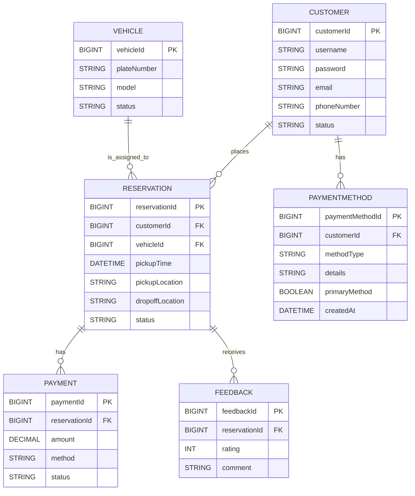
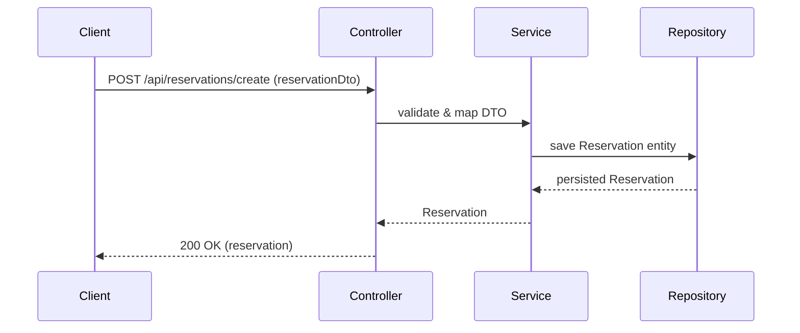

# Car Reservation — Design Document

**Scope**: Document architecture, data model, APIs, components, configuration, observations, and improvement roadmap for the Car Reservation application.

**Last Updated**: February 18, 2026

**Repository entry**
- Main application: [src/main/java/com/af/carrsvt/CarReservationApplication.java](src/main/java/com/af/carrsvt/CarReservationApplication.java#L1-L80)
- Config: [src/main/resources/application.properties](src/main/resources/application.properties#L1-L20)
- Build: [build.gradle](build.gradle#L1-L120)

**High-level summary**
- Monolithic Spring Boot application (Spring Boot 3, Java 21).
- REST API providing CRUD for Customers, Vehicles, Drivers, Reservations, Payments, PaymentMethods, Feedback.
- Persistence: Spring Data JPA + MySQL.
- MapStruct + DTOs present; controllers accept DTOs and map to Entities.
- Tests use Testcontainers for integration testing.

**Tech stack**
- Java 21, Spring Boot 3 (web, webflux, data-jpa)
- MySQL (JDBC driver present)
- MapStruct, Lombok, Jackson, Hibernate Validator
- Build: Gradle
- Tests: JUnit + Testcontainers

**Component map (textual)**
- Controllers: `controller` package — REST endpoints under `/api/*` (CustomerController, VehicleController, DriverController, ReservationController, PaymentController, PaymentMethodController, FeedbackController).
- Services: `service` package — business logic; transactional boundary.
- Repositories: `repository` package — `JpaRepository<T,Long>` implementations.
- Entities: `entity` package — JPA entities (Customer, Vehicle, Driver, Reservation, Payment, PaymentMethod, Feedback).
- DTOs & Mappers: `dto` and `mapper` packages — MapStruct mappers convert Entities <-> DTOs.
- Security: `security` package — CustomerUserDetails, CustomerUserDetailsService, SecurityConfig.

**Architecture diagram (Mermaid)**
```mermaid
flowchart LR
  A[Clients (Web/Mobile)] -->|HTTP JSON| B[API Layer (Controllers)]
  B --> C[Service Layer]
  C --> D[Persistence (Spring Data JPA)]
  D --> E[(MySQL Database)]
  C --> F[Domain Mappers (MapStruct)]
  C --> G[External Integrations]
  subgraph App
    B
    C
    D
    F
  end
```

**ER Diagram (Mermaid)**


**Representative sequence — Create Reservation**


**APIs (representative)**
- Customers: POST `/api/customers/create`, GET `/api/customers/get`, GET `/api/customers/{id}`, PUT `/api/customers/{id}`, DELETE `/api/customers/{id}`
- Reservations: POST `/api/reservations/create`, GET `/api/reservations/get`, GET `/api/reservations/{id}`, PUT `/api/reservations/{id}`, DELETE `/api/reservations/{id}`
- PaymentMethods: POST `/api/payment-methods/create`, GET `/api/payment-methods/get` (with optional customerId filter), GET `/api/payment-methods/{id}`, PUT `/api/payment-methods/{id}`, DELETE `/api/payment-methods/{id}`
- Vehicles, Drivers, Payments, Feedback follow similar CRUD patterns.

**Configuration & runtime**
- DB: configured in `src/main/resources/application.properties` (MySQL at `jdbc:mysql://localhost:3306/car_rsvt`).
- `spring.jpa.show-sql=true` enabled; `spring.jpa.hibernate.ddl-auto` commented out — schema migration is manual unless enabled.
- CommandLineRunner seeds sample `Customer` rows at startup in `CarReservationApplication`.

**Observations & recommended improvements (prioritized)**
1. API layer: ✅ Controllers now accept/return DTOs with MapStruct mappers (PaymentMethodController implemented as reference).
2. Validation: add DTO validation annotations (JSR-380) + `@Valid` in controllers (PaymentMethodController includes `@jakarta.validation.Valid`).
3. Error handling: add global `@ControllerAdvice` for consistent error responses (map `EntityNotFoundException` -> 404, validation -> 400).
4. Security: add Spring Security, password hashing, and secure storage for payment tokens. Do not store raw payment details in `Customer` fields.
5. Dates/times: migrate from `java.util.Date` to `java.time` types for clarity and timezone correctness.
6. Database design: normalize payment methods into separate tables; consider constraints and indexes.
7. Tests: create end-to-end integration tests for key flows using Testcontainers.

**Medium-term architecture options**
- Modular monolith: split modules by package and expose clear module boundaries.
- Microservices: if scale requires, split into Customer, Reservation, Billing (Payments), and Catalog/Vehicle services, with event-driven integration.

**Next steps (per your request)**
- After you review and agree on the architecture diagrams, I will implement the suggested code improvements in this repo in a follow-up change: switch controllers to DTOs + MapStruct mapping, add validation, and add `@ControllerAdvice`.

---

*Document generated by analysis of repository; contact me which diagrams/changes to refine first.*
