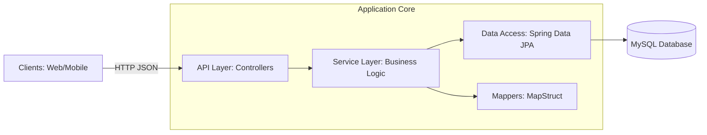
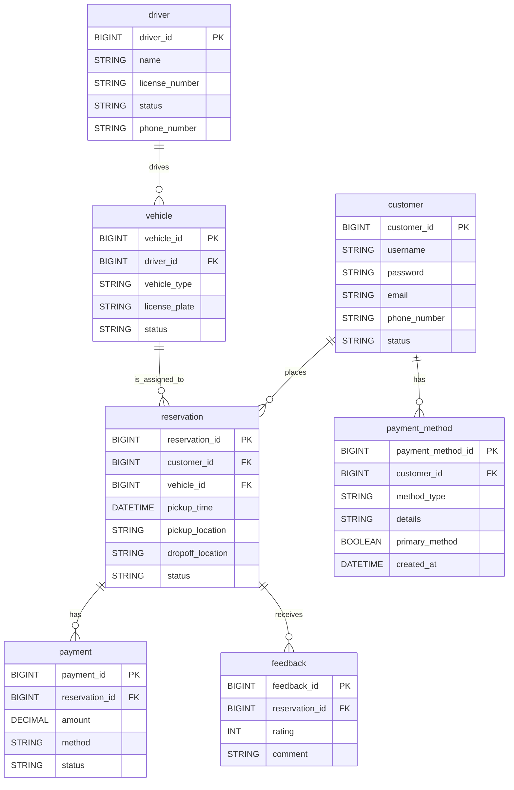
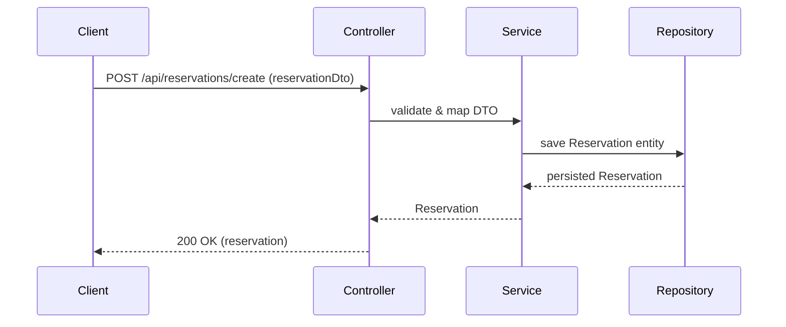

# Car Reservation System — Development & Architecture Guide

**Last Updated**: February 18, 2026  
**Version**: 0.0.1-SNAPSHOT

---

## Table of Contents

1. [Architecture Overview](#architecture-overview)
2. [Tech Stack](#tech-stack)
3. [Project Structure](#project-structure)
4. [Database Schema](#database-schema)
5. [Entity Classes & Relationships](#entity-classes--relationships)
6. [Component Architecture](#component-architecture)
7. [API Endpoints](#api-endpoints)
8. [Configuration](#configuration)
9. [Build & Run Instructions](#build--run-instructions)
10. [Testing Strategy](#testing-strategy)
11. [Development Notes & Roadmap](#development-notes--roadmap)
12. [Useful Commands](#useful-commands)

---

## Architecture Overview

### High-Level Architecture Diagram



### Layered Architecture

```
┌─────────────────────────────────────────┐
│   Client (Web/Mobile/API)               │
└─────────────────────────────────────────┘
                    ↓
┌─────────────────────────────────────────┐
│   API Layer (Controllers)                │
│   - CustomerController                   │
│   - VehicleController                    │
│   - DriverController                     │
│   - ReservationController                │
│   - PaymentController                    │
│   - PaymentMethodController              │
│   - FeedbackController                   │
└─────────────────────────────────────────┘
                    ↓
┌─────────────────────────────────────────┐
│   Service Layer (Business Logic)         │
│   - *Service classes (transactional)     │
│   - MapStruct Mappers (DTO ↔ Entity)     │
└─────────────────────────────────────────┘
                    ↓
┌─────────────────────────────────────────┐
│   Data Access Layer (Repositories)       │
│   - Spring Data JPA Repositories         │
│   - JpaRepository<Entity, Long>          │
└─────────────────────────────────────────┘
                    ↓
┌─────────────────────────────────────────┐
│   Database (MySQL)                       │
│   - 7 entities with relationships        │
└─────────────────────────────────────────┘
```

### Design Principles

- **Monolithic Spring Boot Architecture** (Java 21, Spring Boot 3)
- **REST API**: Full CRUD endpoints for 7 core entities
- **Layered Pattern**: Controllers → Services → Repositories
- **DTO Pattern**: MapStruct for Entity-DTO conversion
- **Spring Security**: Authentication and authorization
- **Integration Tests**: Testcontainers for MySQL

---

## Tech Stack

### Core Framework
- **Language**: Java 21
- **Framework**: Spring Boot 3.4.0
- **Build Tool**: Gradle (wrapper included)

### Libraries & Dependencies
| Component | Library | Version |
|-----------|---------|---------|
| REST API | Spring Boot Web | 3.4.0 |
| Reactive API | Spring Boot WebFlux | 3.4.0 |
| Persistence | Spring Data JPA | 3.4.0 |
| Security | Spring Security | 3.4.0 |
| Validation | Hibernate Validator | 8.0.2.Final |
| DTO Mapping | MapStruct | 1.6.3 |
| Boilerplate | Lombok | 1.18.24 |
| JSON | Jackson Databind | 2.15.2 |
| Database | MySQL Connector/J | Latest |
| Testing | JUnit 5 + Testcontainers | 3.4.0 |

### Runtime Requirements
- **Database**: MySQL 5.7+ (via Docker Compose or local instance)
- **JDK**: Java 21
- **Memory**: Minimum 2GB RAM

---

## Project Structure

```
car_reservation_system/
├── src/
│   ├── main/
│   │   ├── java/com/af/carrsvt/
│   │   │   ├── CarReservationApplication.java     # Main entry point
│   │   │   ├── audit/                             # Audit logging utilities
│   │   │   ├── constant/                          # Application constants
│   │   │   ├── controller/                        # REST controllers (7 entities)
│   │   │   ├── dto/                               # Data Transfer Objects
│   │   │   ├── entity/                            # JPA entities (7 entities)
│   │   │   ├── exception/                         # Custom exceptions
│   │   │   ├── mapper/                            # MapStruct mappers
│   │   │   ├── repository/                        # Spring Data repositories
│   │   │   ├── security/                          # Security configs & services
│   │   │   └── service/                           # Business logic layer
│   │   └── resources/
│   │       ├── application.properties             # Database & app config
│   │       ├── static/                            # Static assets
│   │       └── templates/                         # Thymeleaf templates (optional)
│   └── test/
│       └── java/com/af/carrsvt/
│           ├── integration/                       # Integration tests
│           └── resources/application.properties   # Test config
├── build.gradle                                    # Gradle build configuration
├── settings.gradle                                 # Gradle settings
├── compose.yaml                                    # Docker Compose for MySQL
├── Dockerfile                                      # Multi-stage Docker build
├── init.sql                                        # Database initialization
├── README.md                                       # Project overview
├── DEVELOPMENT.md                                  # This file
└── .gitignore                                      # Git ignore rules
```

---

## Database Schema

### Entity Relationship Diagram



### MySQL Database: `car_rsvt`

#### Create Database
```sql
CREATE DATABASE IF NOT EXISTS car_rsvt;
USE car_rsvt;
```

#### customer Table
```sql
CREATE TABLE customer (
    customer_id BIGINT PRIMARY KEY AUTO_INCREMENT,
    username VARCHAR(100) NOT NULL UNIQUE,
    password VARCHAR(255) NOT NULL,
    email VARCHAR(100) NOT NULL UNIQUE,
    phone_number VARCHAR(20),
    status VARCHAR(20) DEFAULT 'A',
    payment_method_1 VARCHAR(100),
    payment_method_2 VARCHAR(100),
    detail_payment_method_1 VARCHAR(255),
    detail_payment_method_2 VARCHAR(255)
) ENGINE=InnoDB DEFAULT CHARSET=utf8mb4 COLLATE=utf8mb4_unicode_ci;
```

#### vehicle Table
```sql
CREATE TABLE vehicle (
    vehicle_id BIGINT PRIMARY KEY AUTO_INCREMENT,
    driver_id BIGINT,
    vehicle_type VARCHAR(50) NOT NULL,
    license_plate VARCHAR(50) NOT NULL UNIQUE,
    status VARCHAR(20) DEFAULT 'AVAILABLE',
    FOREIGN KEY (driver_id) REFERENCES driver(driver_id) ON DELETE SET NULL
) ENGINE=InnoDB DEFAULT CHARSET=utf8mb4 COLLATE=utf8mb4_unicode_ci;
```

#### driver Table
```sql
CREATE TABLE driver (
    driver_id BIGINT PRIMARY KEY AUTO_INCREMENT,
    name VARCHAR(100) NOT NULL,
    license_number VARCHAR(50) NOT NULL UNIQUE,
    status VARCHAR(20) DEFAULT 'AVAILABLE',
    phone_number VARCHAR(20)
) ENGINE=InnoDB DEFAULT CHARSET=utf8mb4 COLLATE=utf8mb4_unicode_ci;
```

#### reservation Table
```sql
CREATE TABLE reservation (
    reservation_id BIGINT PRIMARY KEY AUTO_INCREMENT,
    customer_id BIGINT NOT NULL,
    vehicle_id BIGINT NOT NULL,
    pickup_time DATETIME(6),
    pickup_location VARCHAR(255),
    dropoff_location VARCHAR(255),
    status VARCHAR(20) DEFAULT 'PENDING',
    FOREIGN KEY (customer_id) REFERENCES customer(customer_id) ON DELETE CASCADE,
    FOREIGN KEY (vehicle_id) REFERENCES vehicle(vehicle_id) ON DELETE CASCADE,
    INDEX idx_customer_reservation (customer_id),
    INDEX idx_vehicle_reservation (vehicle_id)
) ENGINE=InnoDB DEFAULT CHARSET=utf8mb4 COLLATE=utf8mb4_unicode_ci;
```

#### payment Table
```sql
CREATE TABLE payment (
    payment_id BIGINT PRIMARY KEY AUTO_INCREMENT,
    reservation_id BIGINT NOT NULL,
    amount DECIMAL(10, 2) NOT NULL,
    method VARCHAR(50),
    status VARCHAR(20) DEFAULT 'PENDING',
    FOREIGN KEY (reservation_id) REFERENCES reservation(reservation_id) ON DELETE CASCADE,
    INDEX idx_reservation_payment (reservation_id)
) ENGINE=InnoDB DEFAULT CHARSET=utf8mb4 COLLATE=utf8mb4_unicode_ci;
```

#### payment_method Table
```sql
CREATE TABLE payment_method (
    payment_method_id BIGINT PRIMARY KEY AUTO_INCREMENT,
    customer_id BIGINT NOT NULL,
    method_type VARCHAR(50),
    details VARCHAR(255),
    primary_method BOOLEAN DEFAULT FALSE,
    created_at DATETIME(6),
    FOREIGN KEY (customer_id) REFERENCES customer(customer_id) ON DELETE CASCADE,
    INDEX idx_customer_payment_method (customer_id)
) ENGINE=InnoDB DEFAULT CHARSET=utf8mb4 COLLATE=utf8mb4_unicode_ci;
```

#### feedback Table
```sql
CREATE TABLE feedback (
    feedback_id BIGINT PRIMARY KEY AUTO_INCREMENT,
    reservation_id BIGINT NOT NULL,
    rating INT CHECK (rating >= 1 AND rating <= 5),
    comment TEXT,
    FOREIGN KEY (reservation_id) REFERENCES reservation(reservation_id) ON DELETE CASCADE,
    INDEX idx_reservation_feedback (reservation_id)
) ENGINE=InnoDB DEFAULT CHARSET=utf8mb4 COLLATE=utf8mb4_unicode_ci;
```

---

## Entity Classes & Relationships

### 1. Customer
**File**: [src/main/java/com/af/carrsvt/entity/Customer.java](src/main/java/com/af/carrsvt/entity/Customer.java)

**Relationships**:
- One-to-Many: reservation
- One-to-Many: payment_method

**Key Fields**: customer_id (PK), username, email, phone_number, status

### 2. Vehicle
**File**: [src/main/java/com/af/carrsvt/entity/Vehicle.java](src/main/java/com/af/carrsvt/entity/Vehicle.java)

**Relationships**:
- Many-to-One: driver
- One-to-Many: reservation

**Key Fields**: vehicle_id (PK), driver_id (FK), vehicle_type, license_plate, status

### 3. Driver
**File**: [src/main/java/com/af/carrsvt/entity/Driver.java](src/main/java/com/af/carrsvt/entity/Driver.java)

**Relationships**:
- One-to-Many: vehicle

**Key Fields**: driver_id (PK), name, license_number, status, phone_number

### 4. Reservation
**File**: [src/main/java/com/af/carrsvt/entity/Reservation.java](src/main/java/com/af/carrsvt/entity/Reservation.java)

**Relationships**:
- Many-to-One: customer
- Many-to-One: vehicle
- One-to-Many: payment
- One-to-Many: feedback

**Key Fields**: reservation_id (PK), customer_id (FK), vehicle_id (FK), pickup_time, status

### 5. Payment
**File**: [src/main/java/com/af/carrsvt/entity/Payment.java](src/main/java/com/af/carrsvt/entity/Payment.java)

**Relationships**:
- Many-to-One: reservation

**Key Fields**: payment_id (PK), reservation_id (FK), amount, method, status

### 6. PaymentMethod
**File**: [src/main/java/com/af/carrsvt/entity/PaymentMethod.java](src/main/java/com/af/carrsvt/entity/PaymentMethod.java)

**Relationships**:
- Many-to-One: customer

**Key Fields**: payment_method_id (PK), customer_id (FK), method_type, details, primary_method, created_at

### 7. Feedback
**File**: [src/main/java/com/af/carrsvt/entity/Feedback.java](src/main/java/com/af/carrsvt/entity/Feedback.java)

**Relationships**:
- Many-to-One: reservation

**Key Fields**: feedback_id (PK), reservation_id (FK), rating, comment

---

## Component Architecture

### Package Breakdown

| Package | Purpose | Key Classes |
|---------|---------|-------------|
| `controller` | REST endpoints | 7 Controllers (one per entity) |
| `service` | Business logic & transactions | 7 Services |
| `repository` | Database access | 7 JpaRepository implementations |
| `entity` | JPA domain models | 7 Entity classes |
| `dto` | Data transfer objects | 7 DTO classes |
| `mapper` | Entity-DTO conversion | 7 MapStruct mappers |
| `security` | Auth & AuthN | CustomerUserDetails, CustomerUserDetailsService, SecurityConfig |
| `exception` | Custom exceptions | EntityNotFoundException, etc. |
| `audit` | Audit logging | Audit helper classes |
| `constant` | App constants | Constants file |

### Representative Sequence — Create Reservation



---

## API Endpoints

### Base URL: `http://localhost:8080/api`

#### Customers
| Method | Endpoint | Purpose |
|--------|----------|---------|
| POST | `/customers/create` | Create new customer |
| GET | `/customers/get` | Fetch all customers |
| GET | `/customers/{id}` | Get customer by ID |
| PUT | `/customers/{id}` | Update customer |
| DELETE | `/customers/{id}` | Delete customer |

#### Vehicles
| Method | Endpoint | Purpose |
|--------|----------|---------|
| POST | `/vehicles/create` | Create new vehicle |
| GET | `/vehicles/get` | Fetch all vehicles |
| GET | `/vehicles/{id}` | Get vehicle by ID |
| PUT | `/vehicles/{id}` | Update vehicle |
| DELETE | `/vehicles/{id}` | Delete vehicle |

#### Drivers
| Method | Endpoint | Purpose |
|--------|----------|---------|
| POST | `/drivers/create` | Create new driver |
| GET | `/drivers/get` | Fetch all drivers |
| GET | `/drivers/{id}` | Get driver by ID |
| PUT | `/drivers/{id}` | Update driver |
| DELETE | `/drivers/{id}` | Delete driver |

#### Reservations
| Method | Endpoint | Purpose |
|--------|----------|---------|
| POST | `/reservations/create` | Book new reservation |
| GET | `/reservations/get` | Fetch all reservations |
| GET | `/reservations/{id}` | Get reservation by ID |
| PUT | `/reservations/{id}` | Update reservation |
| DELETE | `/reservations/{id}` | Cancel reservation |

#### Payments
| Method | Endpoint | Purpose |
|--------|----------|---------|
| POST | `/payments/create` | Create payment record |
| GET | `/payments/get` | Fetch all payments |
| GET | `/payments/{id}` | Get payment by ID |
| PUT | `/payments/{id}` | Update payment |
| DELETE | `/payments/{id}` | Delete payment |

#### Payment Methods
| Method | Endpoint | Purpose |
|--------|----------|---------|
| POST | `/payment-methods/create` | Add payment method |
| GET | `/payment-methods/get` | Get all methods (optional: filter by customerId) |
| GET | `/payment-methods/{id}` | Get method by ID |
| PUT | `/payment-methods/{id}` | Update payment method |
| DELETE | `/payment-methods/{id}` | Remove payment method |

#### Feedback
| Method | Endpoint | Purpose |
|--------|----------|---------|
| POST | `/feedback/create` | Submit feedback |
| GET | `/feedback/get` | Fetch all feedback |
| GET | `/feedback/{id}` | Get feedback by ID |
| PUT | `/feedback/{id}` | Update feedback |
| DELETE | `/feedback/{id}` | Delete feedback |

---

## Configuration

### Database Configuration
**File**: [src/main/resources/application.properties](src/main/resources/application.properties)

```properties
spring.application.name=Car Reservation

# Database Connection
spring.datasource.url=jdbc:mysql://localhost:3306/car_rsvt
spring.datasource.username=theuser
spring.datasource.password=thepassword
spring.datasource.driver-class-name=com.mysql.cj.jdbc.Driver

# JPA & Hibernate
# spring.jpa.hibernate.ddl-auto=update  # Uncomment to auto-create/update schema
spring.jpa.show-sql=true                # Log all SQL queries
```

### Security Configuration
**File**: [src/main/java/com/af/carrsvt/security/SecurityConfig.java](src/main/java/com/af/carrsvt/security/SecurityConfig.java)

- Spring Security enabled
- CustomerUserDetailsService loads users from database
- Authentication and authorization rules defined
- HTTPS recommended for production

---

## Build & Run Instructions

### Prerequisites - Local Development
- Java 21
- Gradle 8.0+ (or use included gradle wrapper)
- MySQL 5.7+ (or Docker Desktop for compose)
- Optional: IDE (IntelliJ IDEA, VS Code with Spring Extension Pack)

### Prerequisites - Container (Recommended)
- Docker 20.10+
- Docker Compose 2.0+
- No Java/Gradle installation needed in container mode

---

### Option 1: Full Containerized Setup (Recommended) 🐳

**One command to run everything** (MySQL + App):

```bash
cd car_reservation_system
docker compose up -d
```

**Application**: `http://localhost:8080`

**Container Details**:
```
├── MySQL Container (car-reservation-mysql)
│   └── Port: 3306, Database: car_rsvt
│   └── Auto-initializes with init.sql schema
│
└── Spring Boot Container (car-reservation-app)
    └── Port: 8080
    └── Ready when health check passes
```

**Container Commands**:
```bash
docker compose ps                   # Check status
docker compose logs -f app          # Follow app logs
docker compose stop -t 30           # Graceful shutdown
docker compose down                 # Stop and remove
docker compose down -v              # Complete reset (deletes DB)
```

---

### Option 2: Local Development Setup

#### 2A: Docker Compose MySQL Only (Local App)
```bash
docker run -d \
  --name car-mysql \
  -e MYSQL_ROOT_PASSWORD=verysecret \
  -e MYSQL_DATABASE=car_rsvt \
  -e MYSQL_USER=theuser \
  -e MYSQL_PASSWORD=thepassword \
  -p 3306:3306 \
  mysql:8.0

docker exec -i car-mysql mysql -u theuser -pthepassword car_rsvt < init.sql

./gradlew bootRun
```

#### 2B: Local MySQL + Local App
```bash
# Create database
mysql -u root -p
> CREATE DATABASE car_rsvt;
> CREATE USER 'theuser'@'localhost' IDENTIFIED BY 'thepassword';
> GRANT ALL PRIVILEGES ON car_rsvt.* TO 'theuser'@'localhost';
> FLUSH PRIVILEGES;

# Initialize schema
mysql -u theuser -pthepassword car_rsvt < init.sql

# Build and run
./gradlew clean build
./gradlew bootRun
```

**Application**: `http://localhost:8080`

---

## Testing Strategy

### Test Structure
**Directory**: [src/test/java/com/af/carrsvt/](src/test/java/com/af/carrsvt/)

### Integration Tests
- **IntegrationTests.java**: Helper class for test environment setup
- **ContainerConfiguration.java**: Testcontainers MySQL container setup
- **ControllerIntegrationTests.java**: End-to-end API tests

### Running Tests

**Local**:
```bash
./gradlew test                      # Run all tests
./gradlew test --tests ControllerIntegrationTests  # Specific test
```

**Container-Based**:
```bash
docker compose build app            # Build test image
docker compose run --rm app ./gradlew test  # Run tests
```

### View Test Results
```bash
# After tests, open HTML report
open build/reports/tests/test/index.html  # macOS
xdg-open build/reports/tests/test/index.html  # Linux
```

### Test Technologies
- JUnit 5 (Jupiter)
- Testcontainers (MySQL)
- Spring Boot Test
- MockMvc

---

## Development Notes & Roadmap

### Current Implementation Status

#### ✅ Completed (as of Feb 18, 2026)
- [x] 7 Entity models (Customer, Vehicle, Driver, Reservation, Payment, PaymentMethod, Feedback)
- [x] 7 Controllers with CRUD endpoints
- [x] 7 Services with business logic
- [x] 7 Repositories (Spring Data JPA)
- [x] 7 DTOs for API layer
- [x] 7 MapStruct mappers
- [x] Spring Security integration
- [x] Testcontainers setup
- [x] Database schema (MySQL with lowercase identifiers)
- [x] Docker Compose for MySQL + App
- [x] Comprehensive documentation restructured into 2 files

#### Recent Fixes (Feb 18, 2026)
- Deleted DESIGN.md (content consolidated into DEVELOPMENT.md)
- Updated all table names in DEVELOPMENT.md to lowercase
- Restructured into 2 markdown files (README.md + DEVELOPMENT.md)
- Added architecture diagrams to DEVELOPMENT.md
- All SQL schema updated with lowercase identifiers
- All tests passing locally

#### 🔄 Recommended Enhancements

**High Priority**:
- [ ] Global error handling (`@ControllerAdvice`)
- [ ] Input validation on DTOs (JSR-380 annotations)
- [ ] Enhanced Spring Security with password hashing

**Medium Priority**:
- [ ] Advanced queries (filtering, pagination, sorting)
- [ ] Audit logging for CRUD operations
- [ ] API documentation (Swagger/OpenAPI)
- [ ] Business logic: reservation availability checks, pricing calculation

**Long-term**:
- [ ] Microservices migration (Customer, Reservation, Billing, Catalog services)
- [ ] Event-driven architecture
- [ ] Caching layer (Redis)
- [ ] Performance optimization

### Code Style & Conventions

**Naming**:
- Classes: PascalCase (e.g., `CustomerService`)
- Methods: camelCase (e.g., `createPaymentMethod()`)
- Constants: UPPER_SNAKE_CASE
- Database columns: snake_case (e.g., `payment_method_id`)

**Annotations**:
- `@Entity`: JPA entities
- `@RestController`: REST endpoints
- `@Service`: Service layer
- `@Repository`: Data access
- `@Transactional`: Database transactions
- `@Valid`: Input validation
- Lombok: `@Getter`, `@Setter`, `@NoArgsConstructor`, `@AllArgsConstructor`, `@ToString`

---

## Useful Commands

### Docker Compose
```bash
docker compose up -d                # Start all services
docker compose down                 # Stop and remove (keep volumes)
docker compose down -v              # Stop, remove, and delete volumes
docker compose ps                   # Show container status
docker compose logs -f app          # Follow app logs
docker compose logs -f mysql        # Follow MySQL logs
docker compose stop -t 30           # Graceful shutdown (30s timeout)
docker compose restart              # Restart services
docker compose build                # Build images
docker compose exec app sh          # Open shell in app
docker compose exec mysql bash      # Open shell in MySQL
```

### Gradle
```bash
./gradlew clean                     # Clean build directory
./gradlew build                     # Build project
./gradlew bootRun                   # Run application
./gradlew test                      # Run tests
./gradlew tasks                     # Show all tasks
./gradlew dependencies              # Show dependency tree
```

### MySQL (via Docker Compose)
```bash
docker compose exec mysql mysql -u theuser -pthepassword car_rsvt
mysql> SHOW TABLES;
mysql> DESC customer;
mysql> SELECT * FROM customer;
mysql> EXIT;
```

### Git
```bash
git status                          # Check status
git add .                           # Stage changes
git commit -m "message"             # Commit
git log --oneline -10               # View commits
git push origin main                # Push to remote
```

---

**Project**: Car Reservation System  
**Repository**: /home/theuser/workspace/car_reservation_system  
**Last Updated**: February 18, 2026  
**Version**: 0.0.1-SNAPSHOT

---

**End of Development Guide**
